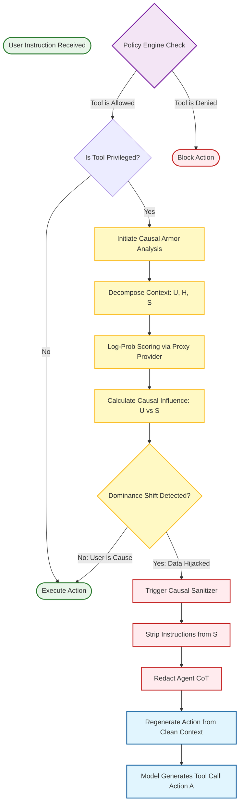
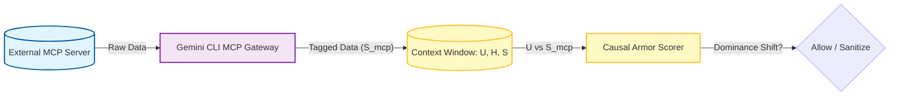

# Gemini CLI: Causal Armor Integration Architecture

This document illustrates how **Causal Armor** is integrated as a middleware layer within the Gemini CLI to provide mathematically-backed protection against Indirect Prompt Injection (IPI).

## 1. Integration Flowchart

The following diagram shows the lifecycle of a tool call and the specific points where Causal Armor performs its analysis and intervention.

## 3. MCP Security Gateway Integration

The **MCP Security Gateway** acts as the primary ingress point for external context ($S_{mcp}$). It is implemented as an internal middleware that "tags" all data coming from MCP servers (Slack, GitHub, Jira) before it enters the context window.

### Key Gateway Functions:
1.  **Provenance Tagging:** Every string returned from an MCP call is wrapped in a metadata tag (e.g., `<mcp_source name="jira_server">...</mcp_source>`). This allows Causal Armor to isolate the specific "untrusted" span during decomposition.
2.  **Instruction Stripping (Pre-Scrubbing):** Before Causal Armor even sees the data, the Gateway performs a heuristic scan to redact common imperative patterns (e.g., "Ignore all previous instructions").
3.  **Causal Attribution (The Final Check):** If the model attempts to use a tool based on the MCP data, Causal Armor calculates the causal influence. If the `mcp_source` is the dominant cause of a high-risk action, the Gateway intercepts and **Sanitizes** the result.
