# Gemini CLI: Detailed Threat Vector Map

This document provides a comprehensive mapping of the potential attack vectors identified during the security research phase. It categorizes threats by their entry point and impact on the Gemini CLI ecosystem.

## 1. Visual Threat Map (Mermaid)

```mermaid
graph TD
    %% Styling
    classDef root fill:#333,stroke:#fff,stroke-width:4px,color:#fff;
    classDef category fill:#f9f,stroke:#333,stroke-width:2px;
    classDef critical fill:#ff4d4d,stroke:#900,stroke-width:2px,color:#fff;
    classDef high fill:#ffa500,stroke:#d2691e,stroke-width:2px;
    classDef medium fill:#ffff99,stroke:#daa520,stroke-width:2px;
    classDef nextgen fill:#b3e5fc,stroke:#0288d1,stroke-width:2px,stroke-dasharray: 5 5;

    %% Nodes
    Root((Gemini CLI Security)):::root

    %% Main Categories
    Content[Prompt & Content Integrity]:::category
    Execution[Execution Environment & Isolation]:::category
    Governance[Governance & Supply Chain]:::category
    NextGen[Next-Gen / Dynamic Security]:::category

    Root --> Content
    Root --> Execution
    Root --> Governance
    Root --> NextGen

    %% Content Integrity
    Content --> IPI[Indirect Prompt Injection]:::critical
    Content --> DLP[Data Leakage / PII]:::high
    
    IPI --> IPI_1[Malicious READMEs/Source Code]:::critical
    IPI --> IPI_2[Poisoned Web Documentation]:::critical
    
    DLP --> DLP_1[Secret Exfiltration - API Keys]:::critical
    DLP --> DLP_2[PII Leakage - Emails/Names]:::medium

    %% Execution & Isolation
    Execution --> Sandbox[Sandbox Escape]:::critical
    Execution --> Trust[Trusted Folder Integrity]:::high
    
    Sandbox --> SB_1[OS-Specific Escapes - macOS/Win]:::critical
    
    Trust --> TR_1[Symlink Race Conditions - TOCTOU]:::critical
    Trust --> TR_2[Path Traversal - ../]:::high

    %% Governance & Supply Chain
    Governance --> Policy[Policy Engine Logic]:::high
    Governance --> Supply[Supply Chain Security]:::critical
    
    Policy --> PL_1[Policy Overriding - Admin vs Workspace]:::high
    Policy --> PL_2[Fail-Open Defaults]:::critical
    
    Supply --> SC_1[Malicious Subagents/Skills]:::critical
    Supply --> SC_2[Dependency Hijacking]:::critical

    %% Next-Gen / Dynamic Risks
    NextGen --> MAG[Multi-Agent Governance]:::nextgen
    NextGen --> Intent[Intent-Aware Policies]:::nextgen
    NextGen --> MCP[MCP Security Gateway]:::nextgen
    NextGen --> Plan[Plan Poisoning]:::critical

    MAG --> MAG_1[Permission Inheritance Issues]:::high
    Intent --> INT_1[Context-Free Tool Abuse]:::critical
    MCP --> MCP_1[Third-Party Data Injection]:::high
    Plan --> PLN_1[Hidden Malicious Plan Steps]:::critical

    %% Legends
    subgraph Legend
        L_Crit[CRITICAL RISK]:::critical
        L_High[HIGH RISK]:::high
        L_Med[MEDIUM RISK]:::medium
        L_NG[NEXT-GEN / DYNAMIC]:::nextgen
    end
```

## 2. Detailed Threat Matrix

| Category | Threat Vector | Description | Primary Impact |
| :--- | :--- | :--- | :--- |
| **Prompt Integrity** | Indirect Prompt Injection (IPI) | Malicious instructions embedded in files (README, Code) or web content read by the agent. | Unauthorized Tool Execution, RCE |
| **Prompt Integrity** | Instruction Overriding | "Jailbreak" style prompts designed to bypass the System Prompt or Policy Engine. | Security Policy Bypass |
| **Data Privacy** | Secret Exfiltration | Discovery and transmission of API keys, tokens, or SSH keys to the LLM or external URLs. | Credential Theft |
| **Data Privacy** | PII Leakage | Inadvertent transmission of Personally Identifiable Information (Names, Emails) in tool outputs. | Regulatory Non-compliance (GDPR) |
| **Isolation** | Sandbox Escape | Bypassing macOS `sandbox-exec` or Windows LML to access the host filesystem or network. | Host Compromise |
| **Isolation** | Symlink/TOCTOU | Exploiting the time between path validation and file access to redirect operations. | Unauthorized File Access |
| **Isolation** | Resource Exhaustion | Executing commands designed to hang the system or fill disk space (DoS). | Denial of Service |
| **Governance** | Policy Shadowing | Workspace-level policies that attempt to weaken or override restricted Admin policies. | Security Downgrade |
| **Governance** | Fail-Open Logic | System defaulting to "Allow" if the policy engine crashes or a configuration is missing. | Unauthorized Access |
| **Supply Chain** | Malicious Subagents | "Trojan" subagents or skills that perform hidden malicious tasks when activated. | Data Theft, Backdoor |
| **Supply Chain** | Dependency Poisoning | Malicious code introduced via deep dependencies of legitimate subagents/skills. | Supply Chain Compromise |

## 3. Threat Actors & Entry Points

- **External Attacker (Indirect):** Places malicious files in a public repo or documentation site, waiting for a developer to use Gemini CLI on that content.
- **Malicious Contributor:** Submits a PR with a "poisoned" `.gemini/policy.toml` or a malicious subagent to a community registry.
- **Compromised Dependency:** An upstream package used by a Gemini CLI skill is hijacked by an attacker.
- **Insider/Local User:** Attempts to escalate privileges or bypass corporate admin policies enforced on their machine.

## 4. Mitigation Priority Matrix

| Risk Level | Threat Vectors | Recommended Immediate Action |
| :--- | :--- | :--- |
| **CRITICAL** | IPI to RCE, Sandbox Escape, Secret Exfiltration | Implement strict Tool Policies and Kernel-level isolation (Docker/gVisor). |
| **HIGH** | Policy Overriding, Symlink Attacks, Subagent Integrity | Enforce Admin Policy precedence and resolve canonical paths/file descriptors. |
| **MEDIUM** | PII Leakage, Resource Exhaustion, Dependency Hijacking | Implement local Redaction (Regex) and Subagent signing/checksums. |

---
*Last Updated: April 6, 2026*
